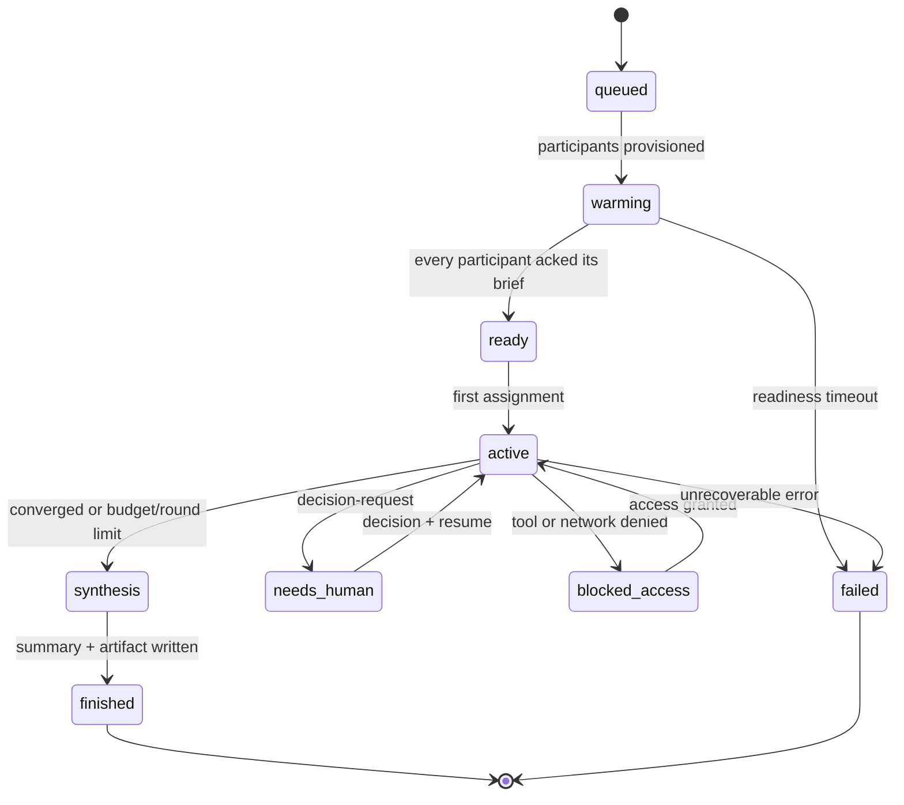
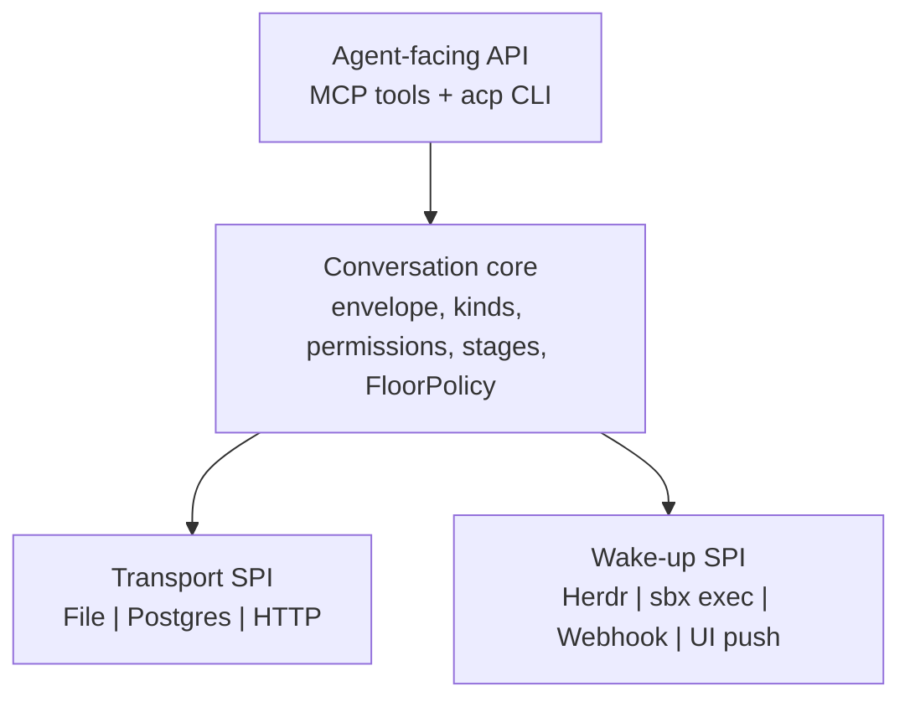
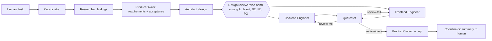

# Bayto Agent Communication Protocol (`acp/1`)

Snapshot: 2026-09-28 · Author: Kibrom · Live doc: https://claude.ai/code/artifact/0c99203a-4ac7-4165-abd3-e9418220563b

This doc defines one message protocol that any team of agents (and humans) uses to talk. It generalizes the file-based `handoff`/`crew` design in [wad-sbx-workshop](https://github.com/Kibrom1/wad-sbx-workshop) so the same contract works in Bayto discussions, coding teams like the workshop factory, and future products such as Sened agents.

## Goals

- **Reusable across products:** the protocol knows nothing about debates, code or COIs. Domain meaning lives in roles and message bodies, not in the protocol.
- **Topology-independent:** works with all agents in one sandbox (Bayto's default for now, as in the workshop) or one sandbox per agent (a later option), on local Docker Sandboxes; a remote runtime could be added behind the same interfaces.
- **Transport-independent:** the same envelope travels over a shared directory, Postgres, or an HTTP/MCP API.
- **Runtime-independent:** Claude Code, Pi, Codex, a custom agent loop or a human all participate through the same verbs.
- **Safe by construction:** exactly-once delivery, no interrupting a busy agent, no busy-waiting, and explicit progress reports rather than guessing from terminal state.

**Non-goals:** agent reasoning, prompt design, and UI. Those sit above this layer.

## What we keep from the workshop

The workshop's `chapters/support/bin` already solves the hard parts of agent-to-agent messaging. These rules carry over unchanged; only their storage and wake-up mechanics change.

| Workshop rule | Where it lives | Why it matters |
| --- | --- | --- |
| Messages are durable files, written atomically (temp file + rename) | `handoff send` | A reader never sees a half-written message |
| Every message has a run/task/attempt-scoped id and a global sequence number | `handoff send`, `next_seq` | Total order and replayable history |
| Delivery is tracked per recipient; `read` = print, then mark consumed | `handoff read`, `consumed/<role>/` | Exactly-once consumption; a crash before ack redelivers instead of losing |
| **Ack is not completion:** reading an assignment says nothing about finishing it | `ack` vs `report` | Progress comes only from explicit reports with checks |
| Reports carry status, stage, output ref and named checks | `handoff report` | The source of truth for progress, not terminal status |
| Single-fire claims via atomic `mkdir` | `handoff claim` | A trigger (e.g. a wake-up) fires once even with several observers |
| **Inspect before you type:** never prompt an agent that is `working`; report `blocked`; read the screen when `unknown` | `crew-notify` | Typing into a busy agent is the failure the design exists to prevent |
| Send, then end your turn; the reply wakes you. No polling loops | `roles/*.md` | Agents don't burn tokens waiting |
| Readiness ack before any work | `start-team`, `ready/<role>` | A session starts only when every role has loaded its brief |
| Human is a participant with an inbox (`crew ask/reply/status`) | `crew` | Decisions are messages, recorded like everything else |
| Decisions are persisted as records with rationale | `decisions/<task>-a<attempt>.json` | Resumed or later agents act on the same decision |
| Bounded waits with explicit exit codes (0 delivered, 3 busy, 4 blocked, 5 unconfirmed, 9 already done) | `handoff wait`, `crew-notify` | Callers can react precisely instead of retrying blindly |

**What changes for Bayto:** for now Bayto keeps the file transport inside the shared team sandbox, exactly as the workshop does, and the orchestrator mirrors messages and reports into Postgres for the UI, replay and audit. The fixed roles (`coordinator developer qa human supervisor`) become dynamic participants from a role catalog. Herdr wake-ups stay the default adapter, and the orchestrator decides who gets the floor. A `PostgresTransport` is deferred until per-agent sandboxes or external agents need it.

## Core model and envelope

Four records make up the protocol: a **Conversation** (the workshop's run + task + attempt), its **Participants**, the **Messages** they exchange, and the **Reports** that state progress.

| Record | Key fields | Workshop equivalent |
| --- | --- | --- |
| Conversation | `conversation_id`, `topic_ref`, `attempt`, `stage`, `floor_policy`, `seq` | `state.json` |
| Participant | `participant_id`, `role`, `kind` (agent, human, moderator, system), `runtime`, `capabilities`, `status` (ready, working, idle, blocked, gone) | fixed role list + `ready/<role>` + Herdr status |
| Message | envelope below | `messages/*.json` |
| Report | `from`, `message_id` (optional, ties the report to the message it answers), `status`, `stage`, `output_ref`, `checks{}`, `summary`, `verified` | `reports/*.json` |

**Message envelope (v1)** — a superset of the workshop's `handoff` JSON, so a file written by the workshop tools is a valid v1 message:

```json
{
  "protocol": "acp/1",
  "message_id": "msg-conv42-0017-k3f9qa",
  "conversation_id": "conv42",
  "attempt": 1,
  "seq": 17,
  "from": "skeptic",
  "to": ["advocate"],
  "visibility": "all",
  "kind": "objection",
  "in_reply_to": "msg-conv42-0015-a81kd0",
  "thread_id": "msg-conv42-0012-p0q2zz",
  "requires_ack": true,
  "refs": { "output_ref": "git:9f2c1e0", "topic_version": "3" },
  "body": "The cost model assumes 40% sandbox idle time; the benchmark showed 12%.",
  "body_format": "markdown",
  "meta": { "urgency": 0.8, "tokens_out": 142 },
  "created_at": "2026-09-28T14:02:11Z"
}
```

- `to` is a list (a single string, as the workshop writes it, is also accepted): one participant, several, or `["all"]`. `visibility` (`all`, `recipients`, `moderator`) lets modes such as blind Delphi rounds hide messages.
- `in_reply_to` and `thread_id` make cross-examination and side threads explicit; the workshop inferred these from context.
- `refs` and `meta` are open maps: domains add keys (a git commit, a COI document id) without changing the protocol.
- **`meta.tokens_in` / `meta.tokens_out` / `meta.cost` (product-owner decision, 2026-09-29): required-but-soft-fail.** Every agent implementation -- in-sandbox Claude Code roles today, any future external/webhook agent -- is expected to populate these on a substantive turn's envelope, since the orchestrator's session budget (docs/product-design.md's token/cost cap) is computed from them. A turn that omits them is never blocked or failed: the orchestrator logs a "budget-accuracy degraded" warning naming the agent/turn and counts that turn as 0 toward the budget, same as today's implicit behavior. `acp send` accepts `--tokens-in`/`--tokens-out`/`--cost` so an agent (or a wrapper script that has the numbers) can populate them; actually instrumenting Claude Code itself to know its own per-turn usage automatically is not wired up here -- see M2.10 (OpenTelemetry spans per turn) and docs/decisions.md.
- The id format keeps the workshop's `msg-<run>-<seq>-<rand>` so ids sort and stay unique without coordination.
- `checks{}` is a map of check name → real exit code (e.g. `{"pytest": 0}`), not an array: a report names each check once, keyed by what it is. `verified` is true when every value in `checks` is 0 — including, by design, when `checks` is empty (no checks run means nothing failed, a vacuous truth). This is deliberate, not an oversight: review discipline is the real backstop against an empty-check report claiming a passing status, not this flag.

## Message kinds

Kinds are a small, closed core plus namespaced extensions (`x-<domain>.<name>`, e.g. `x-code.review-request`). The core keeps every workshop kind and adds the ones discussion needs.

| Kind | Meaning | Typical sender → recipient | From workshop |
| --- | --- | --- | --- |
| `assignment` | Take this work / you have the floor | moderator → agent | yes |
| `question` / `answer` | Directed question and its reply | any → any | yes |
| `proposal` | A position, plan or draft for the group | agent → all | new |
| `critique` | Substantive feedback on a proposal | agent → author (visible to all) | generalizes `review-result` |
| `objection` | Disagreement that may jump the floor queue once per round | agent → speaker | new |
| `agree` | Explicit agreement; counts as a pass, not a turn | agent → all | new |
| `hand-raise` | Request for the floor with `reason` and `urgency` | agent → floor controller | new |
| `decision-request` / `decision` | Ask a human to choose; the human's choice | agent/moderator ↔ human | yes |
| `summary` | Rolling or final synthesis | moderator → all | new |
| `note` | Informational, no action expected | any → any | yes |
| `resume` | Continue after a pause or human decision | moderator/system → agent | yes |
| `report` | Progress/completion with status and checks (stored as a Report) | agent → moderator | yes |

**Send permissions** are declared per role in the mode, not hard-coded. Example for Debate: only the moderator sends `assignment` and `summary`; only humans send `decision`; `objection` is limited to one per participant per round. The transport rejects a message that breaks the policy, the same way `handoff` rejects an unknown role or kind today.

## Delivery guarantees

Every transport must provide these seven guarantees; the conformance suite (see Reuse) checks each one.

1. **Atomic append.** A message is visible whole or not at all. Files: temp + rename. Postgres: one insert in a transaction.
2. **Total order per conversation.** `seq` increases by one per message, assigned under a lock (the workshop's `.seq.lock`; a row lock or sequence in Postgres).
3. **Exactly-once consumption per recipient.** `read` returns unconsumed messages, then marks them consumed. If the reader crashes before marking, the message is redelivered, never lost. Consumption is per recipient, so a broadcast is consumed independently by each participant.
4. **Ack ≠ completion.** `ack` only means "received". Work is finished only when a `report` with a terminal status (`implemented`, `review-pass`, `done`, ...) exists for the current `attempt`.
5. **Stale-report protection.** A report for an older `attempt` never counts as progress (the workshop's `latest-report` exit 4).
6. **Single-fire side effects.** Wake-ups, stage transitions and external writes take a claim key first (`notify:<message_id>:<role>`); a second observer gets "already claimed" and does nothing.
7. **Bounded waiting.** Every wait has a deadline and a distinct outcome code. No caller blocks forever, and no agent polls in a loop.

**Standard outcome codes** (from `crew-notify`/`handoff`, kept for all adapters):

| Code | Meaning | Caller action |
| --- | --- | --- |
| 0 | Delivered | Continue |
| 3 | Recipient busy / wait timed out | Retry later; don't interrupt |
| 4 | Recipient blocked | Escalate to a human |
| 5 | Delivery unconfirmed | Keep the claim; inspect before retrying |
| 9 | Already done (claimed earlier) | Do nothing |

## Floor control

Who may speak next is a pluggable **FloorPolicy**, separate from the message layer. The workshop hard-coded one policy (coordinator → developer → QA); the protocol makes it a setting of the conversation.

```python
class Reason(StrEnum):
    ADDRESSED = "addressed"; NEW_POINT = "new_point"; DISAGREE = "disagree"; AGREE_PASS = "agree_pass"

class HandRaise(BaseModel):
    participant: str
    reason: Reason
    urgency: float            # 0..1
    in_reply_to: str | None = None

FloorDecision = Grant | Parallel | Converged | AskHuman   # Pydantic models, one per outcome

class FloorPolicy(Protocol):
    # Called after every message; returns who gets the floor next, or nobody.
    def next(self, view: ConversationView, raised: list[HandRaise]) -> FloorDecision: ...
```

| Policy | How it picks | Default for |
| --- | --- | --- |
| `raise-hand` | Addressed participant first; else highest urgency, weighted up for `NEW_POINT`/`DISAGREE`; `AGREE_PASS` never gets the floor; speaking-time cap; one queue-jumping `objection` per round | Open chat, Brainstorm, Collaborate |
| `pipeline` | Fixed routing table (e.g. coordinator → developer → qa, failure → developer) | Coding teams (the workshop factory) |
| `round-robin` | Fixed seat order per round | Debate |
| `parallel-blind` | Everyone answers; messages hidden until all have replied | Delphi, independent estimates |
| `moderator-pick` | The moderator agent names the next speaker | Fallback / user override |

**Raise-hand mechanics.** After each message the controller collects `hand-raise` signals. In Bayto they come from one cheap Haiku call over all personas, so the orchestrator doesn't execute every sandbox each turn. An agent that owns its own loop may also send a `hand-raise` message itself; both paths produce the same record.

**Converged** means no raised hands (or only `AGREE_PASS`) for K rounds: the moderator writes the `summary` and the conversation moves to `synthesis`.

**Waking the holder.** A `Grant` becomes an `assignment` message plus one wake-up through the adapter (see Wake-up SPI below). It follows the workshop rule: never wake a `working` participant; queue it instead.

## Conversation lifecycle

A conversation moves through generic stages. The workshop's coding stages (`implementing`, `review`, `correcting`, `ready-for-acceptance`) stay available as domain sub-stages under `active`.



- **warming → ready** is the workshop's readiness ack: each participant loads its role brief, replies `acknowledged`, and does nothing else until assigned.
- **needs_human** is a pause, not a failure. Participants' sandboxes can be stopped while waiting; `resume` wakes the floor holder with the recorded decision.
- **Retries** increment `attempt` rather than rewriting history. Reports and messages from earlier attempts stay readable but never count as current progress.
- Only the conversation owner (the orchestrator, or the coordinator role in single-sandbox mode) may change `stage`, and each transition takes a claim key so it happens once.

## Layered architecture

The protocol is split into four layers with narrow interfaces, so each can be swapped without touching the others. This split is what makes it reusable.



**1. Agent-facing API (what agents and humans actually use).** The verbs are the same whether exposed as MCP tools or as a CLI (`acp`, the successor of `handoff` + `crew send`):

| Verb | Purpose | Workshop equivalent |
| --- | --- | --- |
| `send(to, kind, body, in_reply_to?)` | Store a message and request a wake-up for the recipients | `crew send` |
| `read(kind?)` | Get unconsumed messages for me, then mark them consumed | `handoff read` |
| `ack(message_id)` | Confirm receipt only | `handoff ack` |
| `report(status, stage?, output_ref?, checks{})` | State progress or completion | `handoff report` |
| `raise_hand(reason, urgency)` | Ask for the floor | new |
| `ask_human(question, options[])` | Send a `decision-request` and yield | `crew send human` + `stage needs-human` |
| `transcript(since_seq?)` | Read visible history | `crew watch` |

Role briefs keep the workshop rule: *send, then end your turn; the reply wakes you.* Agents never poll.

**2. Conversation core.** A small library (Python, shared by the FastAPI orchestrator and the in-sandbox `acp` CLI) that validates envelopes, enforces send permissions, assigns `seq`, applies the FloorPolicy and owns stage transitions.

**3. Transport SPI.**

```python
class Transport(Protocol):
    async def append(self, draft: Message) -> Message: ...                 # atomic, assigns seq
    async def unconsumed(self, conv: str, participant: str, f: Filter | None = None) -> list[Message]: ...
    async def mark_consumed(self, conv: str, participant: str, ids: list[str]) -> None: ...
    async def put_report(self, r: Report) -> Report: ...
    async def claim(self, conv: str, key: str) -> ClaimResult: ...        # single-fire
    def subscribe(self, conv: str, since_seq: int = 0) -> AsyncIterator[Message]: ...  # UI streaming
```

| Transport | Use | Notes |
| --- | --- | --- |
| `FileTransport` | Bayto default (one team sandbox per task) and the workshop | Byte-compatible with today's `$FACTORY_DIR` layout; the orchestrator tails and mirrors it |
| `PostgresTransport` | Later: isolated per-agent sandboxes, or when the orchestrator should be the only writer | `messages`, `consumptions`, `reports`, `claims` tables; `LISTEN/NOTIFY` feeds `subscribe` |
| `HttpTransport` | External agents (webhook, A2A bridge) | Wraps the Bayto API; same semantics |

**4. Wake-up SPI.** A message is durable but passive. The wake-up adapter gives the recipient a turn, following the inspect-before-you-type rule.

```python
class WakeUp(Protocol):
    async def inspect(self, p: Participant) -> ParticipantStatus: ...          # working | idle | blocked | unknown
    async def wake(self, p: Participant, trigger: Message) -> WakeResult: ...  # 0, 3, 4, 5 or 9
```

| Adapter | Topology | How it wakes |
| --- | --- | --- |
| `HerdrWakeUp` | Shared team sandbox (Bayto default) | `herdr agent prompt` (today's `crew-notify`) |
| `SbxExecWakeUp` | Headless turns in the shared sandbox, or per-agent sandboxes later | `sbx exec -i <sandbox> acp-turn --role <role>` with the pending messages on stdin (token-level streaming through `claude -p --output-format stream-json`) |
| `WebhookWakeUp` | External agent | POST to the agent's endpoint |
| `UiWakeUp` | Human | Push notification / Bayto room badge |

## Reuse: packaging and conformance

Ship the protocol as its own versioned package, independent of Bayto, with a spec and a test suite every transport and adapter must pass.

```text
agent-comms/
  spec/acp-v1.md                 # this protocol, normative
  schema/message.v1.json         # JSON Schema for envelope, report, hand-raise
  acp/                           # Python package: conversation core, FloorPolicy impls, Transport + WakeUp SPIs
  transport-file/                # FileTransport, compatible with $FACTORY_DIR
  transport-postgres/            # PostgresTransport + migrations
  wakeup-herdr/  wakeup-sbx/  wakeup-webhook/
  cli/acp                        # in-sandbox CLI (handoff + crew successor)
  mcp/acp-mcp                    # same verbs as MCP tools, served via the SBX MCP gateway
  kit/acp/spec.yaml              # SBX mixin kit: installs acp CLI + role-brief conventions
  conformance/                   # black-box tests every transport/adapter must pass
  modes/                         # reusable mode definitions (floor policy + permissions + roles)
```

**Conformance tests** (ported from the workshop's `scripts/tests/crew.py` and `crew-notify.sh`):

- Two writers appending concurrently produce gap-free, unique `seq` values.
- A reader killed between print and consume gets the message again; a completed read never repeats it.
- A broadcast is consumed independently by each recipient.
- A stale-attempt report is not reported as current.
- The same claim key succeeds once and returns 9 afterward.
- A wake-up aimed at a `working` participant returns 3 and sends nothing.
- A message that violates the mode's send permissions is rejected.

**A mode is data, not code.** Reusing the protocol for a new team means writing a mode file, not changing the core:

```yaml
mode: code-factory            # the workshop, expressed as a mode
floor_policy: pipeline
roles:
  coordinator: { may_send: [assignment, question, decision-request, summary, note] }
  developer:   { may_send: [report, question, answer, note, x-code.review-request] }
  qa:          { may_send: [report, critique, question, note] }
  human:       { may_send: [decision, question, note] }
route:
  start: coordinator
  developer.report.implemented: qa
  qa.report.review-fail: developer
  qa.report.review-pass: coordinator
```

**Where it gets reused**

| Product | Mode | Transport | Wake-up |
| --- | --- | --- | --- |
| Workshop factory (today) | `code-factory` | File | Herdr |
| Bayto discussions | `open-chat`, `debate`, `brainstorm`, `delphi` | File (mirrored to Postgres) | Herdr |
| Sened (e.g. COI review panel) | `x-coi-review` with extractor, compliance checker, human approver | File or Postgres | Herdr / webhook |
| External agents | Any | HTTP | Webhook / A2A bridge |

**Migration path:** implement `FileTransport` + `HerdrWakeUp` first and run the workshop factory on the new `acp` CLI unchanged in behavior. That proves compatibility before Bayto depends on it (roadmap M1).

## Team roles

Roles are data: a catalog of role definitions that users can edit, rename, remove or extend. The protocol only knows role ids and their permissions. The seven roles below ship as the default catalog.

| Role | Responsibility | May send | Hands work to | Tool profile |
| --- | --- | --- | --- | --- |
| Researcher | Gathers facts, prior art and sources; answers open questions with citations | `note`, `answer`, `proposal` (findings), `report` | Product Owner, Architect | Web search + fetch; no code write access |
| Product Owner | Owns requirements, acceptance criteria and priority; accepts or rejects results; escalates business calls to the human | `proposal` (requirements), `answer`, `critique`, `decision-request`, `report` (accepted / rejected) | Coordinator, Architect | Read-only project access |
| Coordinator | Routes work, owns stage transitions and the floor in pipeline phases; never writes code (as in the workshop) | `assignment`, `summary`, `resume`, `decision-request`, `question`, `note` | Any role | Messaging tools only |
| Architect | System design, ADRs, interface contracts; reviews designs and big changes | `proposal` (design), `critique`, `answer`, `report` | Backend and Frontend Engineers | Read-only code; diagram tools |
| Backend Engineer | Implements APIs, services, data model; runs backend tests | `report` (implemented), `question`, `answer`, `x-code.review-request`, `note` | QA/Tester | Code write, container runtime, DB containers |
| Frontend Engineer | Implements UI against the API contract; runs UI tests | `report` (implemented), `question`, `answer`, `x-code.review-request`, `note` | QA/Tester | Code write, browser (Playwright) |
| QA/Tester | Reviews the exact commit against the task and policy; writes and runs tests | `report` (review-pass / review-fail), `critique`, `question` | Coordinator; failures go back to the engineer | Code read, test runners, browser |

The human is always an implicit participant and the only sender of `decision`.

Tool profiles are enforced by the harness (Claude tool permissions) and by the `acp` send permissions. In the shared team sandbox all roles share one filesystem, one network allowlist (the union of every role's needs) and one Docker daemon, so a tool profile is a policy, not a VM boundary.

**Role definition format** (one file per role in `roles/`, versioned like agents):

```yaml
id: backend-engineer
name: Backend Engineer
brief: roles/backend-engineer.md      # system prompt / role contract, as in the workshop
may_send: [report, question, answer, note, x-code.review-request]
receives: [assignment, question, answer, critique, decision, resume]
default_floor: pipeline               # how it behaves when the mode doesn't say
tools:                            # enforced by the harness (Claude tool permissions), not by the VM
  allow: [Read, Write, Edit, Bash]
  deny: [WebFetch]
team_needs:                       # merged into the team sandbox (union across roles)
  kits: [container-runtime]
  network_allow: [pypi.org, files.pythonhosted.org]
default_model: claude-sonnet
```

Users change the team in three ways: pick a subset (e.g. Researcher + Architect + Product Owner for a design debate), edit a role (brief, permissions, model), or add a custom role (e.g. Security Reviewer, Data Engineer) from the same format. A mode validates that its routes only reference roles present in the team.

**The product-team mode** combines floor policies by phase: pipeline for handoffs, raise-hand for discussion.



```yaml
mode: product-team
phases:
  - name: discovery      # Researcher + Product Owner
    floor_policy: pipeline
    route: { start: coordinator, coordinator: researcher, researcher.report.done: product-owner }
  - name: design         # open discussion until converged
    floor_policy: raise-hand
    participants: [architect, backend-engineer, frontend-engineer, product-owner]
    exit: converged
  - name: build
    floor_policy: pipeline
    parallel: [backend-engineer, frontend-engineer]
    route:
      backend-engineer.report.implemented: qa-tester
      frontend-engineer.report.implemented: qa-tester
      qa-tester.report.review-fail: $author      # back to whoever implemented it
      qa-tester.report.review-pass: product-owner
  - name: acceptance
    route: { product-owner.report.accepted: coordinator, product-owner.report.rejected: build }
```

Skipping a role is safe: if the team has no Researcher, the discovery route falls through to the Product Owner. If there's no Product Owner, acceptance goes to the human.

## Security

- **Identity comes from the transport, not the body.** With the file transport, the `acp` CLI sets `from` from the `FACTORY_ROLE` environment variable that the launcher gives each Herdr session (as in the workshop). With the Postgres or HTTP transport, `from` comes from a per-participant token. All agents are first-party Claude instances for now, so a spoofed `from` is an accepted risk until isolated seats exist.
- **Message bodies are untrusted data.** Wrap them in delimiters when building another agent's context, and never turn them into tool calls or instructions for the platform. This limits prompt injection between agents.
- **Least privilege per role:** send permissions and visibility come from the mode. In the workshop's words, the adapter's small tool surface is the boundary.
- **One team sandbox means shared storage between agents.** Inside the sandbox, isolation between agents is by protocol (send permissions, floor control) and tool permissions, not by VM. The VM still isolates the whole team from the host. Untrusted or imported agents need their own isolated sandbox (later option) and must not join the shared one.
- **Audit:** the append-only message and report log is the audit trail. Decisions keep their rationale and the human who made them.

## Open questions

- [ ] Include domain sub-stages in core (as the workshop's coding stages are today) or move them all to extensions?
- [x] Is a CLI worth keeping next to MCP? It's needed for Pi and other harnesses without an MCP client (as in the workshop), so probably yes. **Resolved (2026-10-04): yes, keep both -- not exclusive.** The acp CLI is the real, used surface across M1-M3 (every role brief, every conformance test); MCP exposure is a separate, additive milestone (M4, Bayto MCP server via the SBX gateway) wrapping the same verbs for harnesses with an MCP client, while the CLI stays needed for Pi and similar harnesses.
- [x] Should `hand-raise` come only from the central Haiku call, or should agents with persistent loops be allowed to send their own? **Resolved (2026-10-04): both, already shipped.** M2.6 implemented the central-scorer path (`AnthropicHandRaiseScorer`) and M2.7 implemented the self-emitted `hand-raise` Envelope convention side by side; both produce the same `HandRaise` record, exactly as this question anticipated. No further decision needed.
- [ ] Should the spec adopt A2A message shapes for external interoperability, or keep `acp/1` and bridge to it?
- [ ] Should `agent-comms` be open-sourced to drive adoption?
- [x] When do we add isolated per-agent sandboxes (an `isolation: own` participant flag): for imported agents, untrusted code, or per-role network limits? **Resolved (2026-10-04): deferred, per the existing 2026-09-28 decision.** Already Decided separately (docs/decisions.md, 2026-09-28: all agents of a task share one team sandbox for now, per-agent sandboxes are a later option); this open question was simply never synced to that decision. No new condition set now -- revisit when a concrete need appears.
- [ ] Is message-level streaming (Herdr) enough for the Bayto room, or do we need the headless turn runner for token-level streaming?
