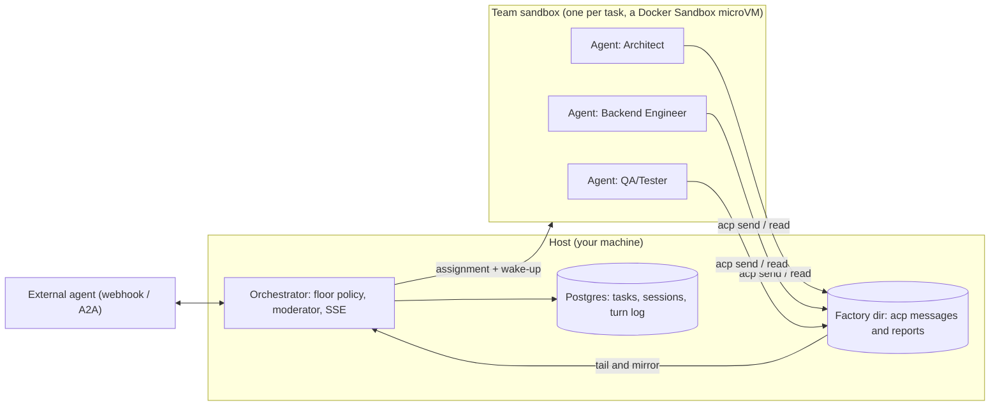
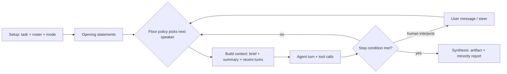

# Bayto (ባይቶ) — Multi-Agent Discussion Platform

Snapshot: 2026-09-28 · Author: Kibrom · Live doc: https://claude.ai/code/artifact/765aedfd-2f81-4f54-9ad3-db7161a73404

## Vision

Bayto lets a user pose a task or topic, seat a panel of AI agents around it, and watch them chat, collaborate, debate and converge on an output. The user acts as convener: they pick who is in the room, set the rules of engagement, and can step in at any point.

**The name:** *Bayto* (ባይቶ) is the traditional Tigrigna village assembly, where the community gathers, debates an issue openly and decides together. The product recreates that council with AI agents.

- **Problem:** a single model answer hides the trade-offs. Real decisions benefit from multiple viewpoints, adversarial pressure and structured synthesis.
- **Promise:** "a meeting of experts on demand" — a security reviewer, a product manager and a skeptical CFO debating your architecture in minutes, with a clear summary at the end.
- **Principle:** conversation is a means, not the product. Every session ends in a concrete artifact (decision, plan, draft, ranked list).

## Core concepts

Five nouns carry the whole product; everything else is configuration on top of them.

| Concept | What it is | Key fields |
| --- | --- | --- |
| Task (Topic) | The question or job the Bayto works on | title, brief, context files/links, desired output, success criteria |
| Agent | A participant with a persona, model and optional tools | name, role, system prompt, model, tools, stance, avatar |
| Session | One run of agents on a task under a chosen mode | task, roster, mode, rules, budget, status, transcript |
| Moderator | An LLM agent that controls flow | turn policy, stop conditions, summarization prompt |
| Artifact | The structured output a session produces | type (decision, plan, draft, list), content, provenance to turns |

A task can have many sessions, so users can rerun the same question with a different roster or mode and compare results side by side.

## Interaction modes

A mode is a reusable template of turn rules, roles and an output shape; the user picks one per session and can author their own.

| Mode | How agents interact | Ends with |
| --- | --- | --- |
| Open chat | Free-form, raise-hand turn-taking (see research/turn-taking.md) | Moderator summary |
| Collaborate | Agents split the task into parts, each drafts one, then critique and merge | Merged draft or plan |
| Debate | Two or more sides argue fixed positions over N rounds; a judge agent scores | Verdict with strongest arguments per side |
| Brainstorm | Diverge phase (no criticism), then cluster and rank | Ranked idea list |
| Review / critique | One author agent presents; reviewers comment; author revises | Revised artifact + change log |
| Red team | Attackers probe a plan for failure modes; defenders respond | Risk register with mitigations |
| Delphi / vote | Agents answer independently, see anonymized peers, revise over rounds | Consensus estimate + spread |
| Interview | Agents question the user (or a persona) to gather requirements | Structured requirements brief |

Modes compose: a common pipeline is Brainstorm → Debate the top 3 → Collaborate on the winner.

## Agent definition

An agent is a declarative spec stored in a library, so the same "Skeptical CFO" can be seated at many tasks.

```yaml
id: skeptical-cfo
name: Dana (CFO)
role: Challenges cost, ROI and runway assumptions
persona: Direct, numbers-first, allergic to hand-waving
model: claude-sonnet   # Claude models only in MVP; other providers later
temperature: 0.6
stance: devil's-advocate   # neutral | advocate | devil's-advocate | assigned-position
tools: [web_search, calculator]
knowledge: [finance-playbook.pdf]
memory: task              # none | session | task (never carried across tasks)
max_tokens_per_turn: 400
```

- **Diversity by design:** personas alone converge fast. Vary stance, model, temperature and knowledge sources to get real disagreement.
- **Agent library:** templates (Architect, Security Reviewer, PM, Lawyer, Customer, Historian) plus user-built agents; an "auto-cast" option lets the moderator propose a roster from the task brief.
- **Human seat:** the user can also sit at the table as a participant, not only as an observer.

## Bring your own agents

Bayto can seat agents that already exist elsewhere next to its native agents. An adapter layer makes every seat look identical to the orchestrator: it receives a turn request and returns a streamed reply.

| Source | How it connects | Notes |
| --- | --- | --- |
| A2A-compatible agents | Discover via the agent's Agent Card URL; send turns as A2A messages, stream replies | Preferred open standard; no custom code per agent |
| Custom HTTP webhook | Bayto POSTs a turn envelope; agent returns text (or SSE stream) | Simplest path for your own agents, e.g. Sened or Gashana agents |
| Claude Agent SDK / Claude API agents | SDK adapter; agent keeps its own tools and system prompt | Good for agents already built on Claude |
| Framework agents (LangGraph, CrewAI, AutoGen, OpenAI Responses) | Per-framework adapter or wrap behind the webhook contract | Community adapters later |
| MCP server exposing an agent as a tool | Bayto calls the tool with the turn context | Useful when an agent is only reachable through MCP |
| Agent definition files (YAML, Markdown subagent files) | Imported and converted into native Bayto agent specs | Runs on Bayto's own runtime, not remotely |

**Adapter contract** — every external agent is wrapped behind one interface:

```python
class AgentAdapter(Protocol):
    def describe(self) -> AgentCard: ...                              # name, role, capabilities, limits
    def respond(self, req: TurnRequest) -> AsyncIterator[TurnChunk]: ...  # streamed reply for one turn
    async def health(self) -> HealthStatus: ...
```

```json
{
  "sessionId": "ses_123",
  "turn": 7,
  "mode": "debate",
  "seat": { "role": "Security reviewer", "stance": "devil's-advocate" },
  "task": { "title": "...", "brief": "..." },
  "summary": "moderator rolling summary",
  "recentTurns": [ { "speaker": "Dana (CFO)", "content": "..." } ],
  "instruction": "Respond to Dana's cost argument in under 300 words.",
  "limits": { "maxTokens": 400, "timeoutMs": 30000 }
}
```

**Registration flow**

1. Paste an Agent Card URL, webhook URL or definition file.
2. Bayto fetches capabilities, stores credentials in a secrets vault, and runs a test turn.
3. The user sets seat overrides: display name, stance, token cap, what context the agent may see.
4. The agent is saved to the library with an "External" badge and can be dragged onto any task like a native agent.

**Design considerations**

- **Trust:** treat external replies as untrusted input. Sanitize before they enter other agents' context to limit prompt injection between agents; external agents get no Bayto tool permissions.
- **Reliability:** per-turn timeout; on failure the moderator skips the seat and notes it in the transcript. Circuit-break agents that fail repeatedly.
- **Cost:** external agents report usage if they can; otherwise Bayto records latency and an estimated cost, labeled as estimated.
- **State:** pass a stable `sessionId` so agents with their own memory keep continuity across turns.
- **Versioning:** snapshot the Agent Card at session start, so replays show which version spoke.

## Agent explorer

The Agent explorer is where users find existing agents and add them to a task. It unifies every source into one searchable catalog, backed by an agent registry service.

**Catalog sources**

| Source | What's in it | Visibility |
| --- | --- | --- |
| My agents | Agents the user built or imported | Private |
| Templates | Bayto-curated starters (Architect, CFO, Security Reviewer, etc.) | All users |
| Team agents | Agents shared inside a workspace | Workspace members |
| Community marketplace | Agents published by other users, with ratings | Public |
| External registries | A2A Agent Cards, MCP registry entries, webhook agents registered by URL | Per registration |

**Finding agents**

- **Search:** keyword plus semantic search over name, role, persona and capabilities (embeddings in pgvector).
- **Filters:** capability/tools, model, protocol (native, A2A, webhook, MCP), source, verified badge, avg cost per turn, latency, rating.
- **Recommend for this task:** Bayto embeds the task brief and suggests a roster. The ranking favors relevance and diversity of stance, so the panel isn't five similar agents.
- **Saved rosters:** reusable panels (e.g. "Architecture review board") added to a task in one click.

**Agent detail page**

- Agent Card: role, persona, model, tools, sandbox profile, owner, version history.
- Track record: sessions joined, avg cost and latency per turn, debate win rate, user ratings and reviews.
- Sample transcript excerpts from public sessions.
- **Try it:** run a single test turn against a sample prompt in a throwaway sandbox before committing.

**Adding to a task**

1. From the explorer, click **Add to task** (or drag the card onto a task's roster in session setup).
2. Set seat overrides: display name, stance, token cap, context visibility.
3. Bayto validates compatibility (mode requirements, budget, required secrets) and flags issues before the session starts.
4. The seat is pinned to the agent version at add time; the user is notified when a newer version exists.

## Agent sandboxes

**Decision (2026-09-28): all agents of a task share one team sandbox, for now.** This is the topology of the reference workshop: a single Docker Sandbox per task, one Herdr session per agent, and file messages between them. Per-agent sandboxes stay a later option (an `isolation: own` flag on a participant) for untrusted or imported agents. The orchestrator owns the floor and the transcript; agents talk through `acp` messages (see [agent-communication-protocol.md](agent-communication-protocol.md)).



**What the team sandbox contains**

- The agent runtimes: a Claude Code process per participant, each in its own Herdr session with its own role brief and model.
- The `acp` CLI and role briefs, installed by the `bayto-team` kit.
- The task's project files (mounted workspace) and a read-only mount of task context files.
- One factory directory (host-mounted) that holds the `acp` messages and reports.
- Credentials injected by the SBX proxy, so agents never hold the real Anthropic key.

**Agent types**

| Agent type | Where it runs |
| --- | --- |
| Native Bayto agent | A Herdr session inside the team sandbox |
| Remote external agent (A2A, webhook) | On its owner's infrastructure; the orchestrator reaches it through the webhook adapter, so it is not in the sandbox |
| Packaged / imported agent (container image) | Deferred: untrusted code needs its own isolated sandbox (later option) |

**Lifecycle**

1. **Create** the team sandbox when a task's first session starts: `sbx env create` from `team.sbxenv.yaml`, mount the factory directory, then start the team (a Herdr session per participant, each acknowledging its brief before any work).
2. **Run** sessions: each session is a new conversation (attempt) in the same sandbox. Agents keep their Claude session context, which gives task-scoped memory.
3. **Idle**: the sandbox may stop when no client is attached; the next `sbx exec` starts it again. The orchestrator reconciles with `sbx ls` after a restart.
4. **Remove** the sandbox with `sbx env rm` when the task is closed. Transcripts stay on the host (factory files and Postgres) for replay.
5. **Replay/fork** rebuilds from the event-sourced turn log.

**Limits and controls:** sandbox CPU and memory sized to the roster, a cap on agents per sandbox, per-turn wall-clock enforced by the orchestrator, max tool calls per turn through harness settings, and a kill switch in the Bayto room (stop one agent's Herdr session, or remove the sandbox). Resource usage feeds the cost meter.

**Runtime decision: Docker Sandboxes, local only.** The team runs in a [Docker Sandbox](https://docs.docker.com/ai/sandboxes/): a microVM with its own kernel, a private Docker daemon inside, and network, filesystem and credential policies enforced outside the VM. It runs on the developer's machine, driven by the `sbx` CLI (macOS Hypervisor.framework, Windows WHP or Linux KVM). Docker's cloud sandboxes are not planned; the `SandboxProvider` interface keeps that door open. Details in [../research/docker-sandboxes.md](../research/docker-sandboxes.md).

**How Bayto maps onto local sbx**

| Bayto concern | Local Docker Sandboxes feature (as used in wad-sbx-workshop) |
| --- | --- |
| Team sandbox definition | A `team.sbxenv.yaml` (name arg, agent, workspace, cpus/memory, kits, mcp servers); `sbx env create FILE --env-arg name=<task> --auto-approve` |
| Runtime | A `bayto-team` kit built like the workshop's `kits/pi` and `kits/herdr`: Claude CLI, Herdr, `acp` CLI, role briefs |
| Agent processes | `start-team`: one Herdr session per participant from a generated `team.tsv` (role, harness, provider, model) |
| Running a turn | The orchestrator writes an `assignment` and wakes the role (`sbx exec <sandbox> crew-notify <role>` → Herdr prompt). The agent runs `acp read`, works, runs `acp send` / `acp report`, and ends its turn |
| Live transcript | The host-mounted factory directory, tailed by the orchestrator (fallback: `sbx exec <sandbox> acp transcript --since N`) |
| Size | `sandboxOptions.cpus` / `memory`; the workshop uses 4 CPUs and 8 GB. Size by roster and measure in M1 |
| Network egress | Kit `permissions.network.allow`: the union of what all roles need |
| Secrets | Kit `credentials` block: the SBX proxy injects the Anthropic key per domain; the real key never enters the VM |
| Task context files | Workspace mount plus `sbx mount <sandbox> <host-dir>:/home/agent/context:ro`, revoked with `sbx umount` |
| Task-scoped memory | Each role's Claude session state lives in the sandbox home; the sandbox is kept for the task's lifetime (verify in M1 that state survives stop/start) |
| Host tools | SBX MCP gateway to Bayto's MCP server on the host (M4) |
| Inspection / debugging | `sbx ls`, `sbx inspect <sandbox>`, `sbx exec -it <sandbox> bash`, `crew logs <role>` |

**Constraints to design around**

- **One VM, many agents:** the number of agents is limited by the sandbox's CPU and memory. Measure with 3, 5 and 7 agents in M1 before promising a roster size.
- **Isolation between agents is policy-level, not VM-level.** Agents share one filesystem, network allowlist and Docker daemon. Per-role limits come from the harness tool permissions and `acp` send permissions. The VM still protects the host from the whole team.
- **Shared network allowlist:** the union of every role's needs (a Researcher's web access is available to all agents unless tools deny it).
- **Status detection is unreliable** (Herdr), so follow the workshop's rules: inspect before you type, treat reports as the source of truth, never interrupt a working agent.
- **Streaming granularity:** Herdr sessions deliver a message per turn. If token-level streaming is needed for the Bayto room, add a headless turn runner (`claude -p --output-format stream-json` through `sbx exec` in the same sandbox). Decide in M1.
- **Host mount semantics:** the `handoff` script notes that `cp` on a virtiofs-backed workspace has produced NULL-filled files, and it writes with temp file plus rename. Test a read-write factory mount in M1; fallback is a sandbox-local factory directory read through `sbx exec`.
- **Platforms:** the workshop is tested on macOS (Apple silicon) and Windows; Linux is best-effort.
- **Cost:** local `sbx` and local compute are free, including commercial use; only model tokens cost money.
- **Pinned versions:** pin `sbx`, the Claude CLI, Herdr and kit refs; SBX is moving fast.

## Orchestration

A session is a state machine driven by the moderator: each loop decides who has the floor, builds that agent's context, generates a turn, then checks stop conditions.



**Turn-taking policies** (pluggable `FloorPolicy`; see the protocol doc and research/turn-taking.md)

- Raise-hand (default for open chat, brainstorm, collaborate): agents signal wants-floor with reason and urgency; addressed agents go first; "agree" is a pass.
- Round-robin: predictable, good for debate rounds.
- Pipeline: fixed routing table for work teams (coordinator → engineer → QA).
- Parallel-blind: all agents answer independently (Delphi), then see each other.
- Moderator-pick: the moderator names the next speaker (fallback / override).

**Stop conditions:** max rounds, token/cost budget, consensus detected (no raised hands for K rounds), no new arguments for K turns, or user ends it.

**Context management:** keep a rolling moderator summary plus the last N turns, so long debates don't blow the context window. Each agent sees only what its role should see (e.g., blind voting in Delphi).

**Anti-patterns to guard against:** sycophantic agreement, agents restating each other, one agent dominating. Mitigate with stance prompts, a "must add a new point or pass" rule, and speaking-time caps.

## UI concept

Three screens cover the MVP: a task board, a session setup panel, and the live "Bayto room".

1. **Task board** — list of tasks with status, last session, and output artifact. "New task" opens a brief editor with context uploads.
2. **Session setup** — pick agents in the Agent explorer and add them to the task (or click "Auto-cast"), choose a mode, set rounds and budget, preview estimated cost.
3. **Bayto room** (main screen)
   - Left: roster with avatars, stance badges, speaking-time meter, mute/remove/add-agent mid-session.
   - Center: streaming transcript, threaded by round; tool calls collapsible; citations inline.
   - Right: live moderator summary, emerging positions/agreement map, and the artifact being built.
   - Bottom: user composer with actions — interject, ask a specific agent, pause, force a vote, end and synthesize.
4. **Replay & compare** — scrub through a finished session; view two sessions of the same task side by side.

Key interaction: **@mention an agent** to direct a question, and **pin a turn** to force the group to address it next.

## Architecture and data model

The core is an orchestrator service that runs sessions as durable, resumable workflows and streams turns to the UI over WebSockets/SSE.

| Component | Responsibility | Candidate tech |
| --- | --- | --- |
| Web UI | Task board, setup, Bayto room, replay | React / Next.js, SSE or WebSocket stream |
| API | Tasks, agents, sessions CRUD; auth | Python: FastAPI + Pydantic |
| Orchestrator | Mode state machine, floor policy, stop checks, synthesis | Python (asyncio) in the FastAPI service; event-sourced loop on Postgres, Temporal Python SDK if durability needs grow |
| Model gateway | Provider abstraction, retries, cost metering, prompt caching | Reuse the AI control plane routing layer |
| Tool runtime | Web search, retrieval over context files, code exec | MCP servers per tool |
| Store | Entities + append-only turn log | Postgres (+ pgvector for context retrieval) |
| Telemetry | Tokens, latency, cost per agent/turn | OpenTelemetry → Grafana |
| Agent registry | Catalog of native, team, marketplace and external agents; search, recommendations, health checks | Postgres + pgvector, scheduled Agent Card refresh |
| Sandbox runtime | One shared team sandbox per task; a Herdr session per agent; limits, network allowlist, credential injection | Local Docker Sandboxes (microVMs) via the `sbx` CLI; behind SandboxProvider |

**Data model (core tables)**

- `task(id, title, brief, output_type, success_criteria, owner_id)`
- `agent(id, kind, name, role, system_prompt, model, params_json, tools[], stance, protocol, endpoint, auth_ref, card_json, version)`
- `agent_listing(agent_id, source, visibility, verified, rating, sessions_count, avg_cost_per_turn, embedding)`
- `mode(id, name, phases_json, turn_policy, stop_rules_json, output_schema)`
- `session(id, task_id, mode_id, status, budget, started_at, ended_at)`
- `session_agent(session_id, agent_id, agent_version, seat_order, muted, harness, model, isolation)`  (`isolation`: `shared` now, `own` later)
- `sandbox(id, task_id, provider, name, image, status, cpu, memory_mb, egress_policy, created_at, closed_at)`  (one team sandbox per task)
- `message(...)`, `report(...)`  (mirrored from the acp files for the UI, replay and audit)
- `turn(id, session_id, seq, speaker_id, round, content, tool_calls_json, tokens_in, tokens_out, cost)`
- `artifact(id, session_id, type, content_json, source_turn_ids[])`

Live messages and reports are `acp` files in the team sandbox's factory directory; the orchestrator mirrors them into Postgres for the UI, replay and audit. A full `PostgresTransport` is deferred until per-agent sandboxes or external agents need it. The turn log is event-sourced: replay, forking a session from turn N, and audit all fall out of it for free.

## Cost, safety and quality controls

Multi-agent sessions multiply token spend by roster size × rounds, so budgets and quality checks are first-class, not add-ons.

- **Budgets:** per-session hard cap in tokens and dollars; live cost meter in the UI; pre-run estimate from roster × rounds × avg turn size.
- **Cheap routing:** small models for floor signals, summaries and stop checks; larger models only for substantive turns and final synthesis. Prompt-cache the shared brief.
- **Loop guards:** max turns, repetition detection (embedding similarity between consecutive turns), and a no-progress timeout.
- **Grounding:** agents cite context files or search results; synthesis flags claims with no source.
- **Quality evals:** score each session on diversity of viewpoints, coverage of success criteria, and whether the artifact changed after debate (evidence the debate mattered).
- **Safety:** tool permissions per agent; no external side effects (email, writes) without user approval; standard content filtering on all turns.

## Reference implementation: wad-sbx-workshop

[Kibrom1/wad-sbx-workshop](https://github.com/Kibrom1/wad-sbx-workshop) is a working multi-agent team on Docker Sandboxes. Bayto reuses its building blocks; Bayto keeps its topology for now: all agents in one sandbox, Herdr sessions, file messages. What changes is a dynamic roster and role catalog, an orchestrator that owns the floor and the transcript, and a Python `acp` package replacing `handoff`. Full analysis: [../research/wad-sbx-workshop-analysis.md](../research/wad-sbx-workshop-analysis.md).

## Roadmap and implementation plan

The MVP proves one thing: a debated answer is measurably better than a single-agent answer to the same task. It ships as M0–M6 below. M0 reuses the workshop almost unchanged; each later milestone replaces one workshop piece with a Bayto component. The task-level breakdown is in [work-plan.md](work-plan.md).

**MVP scope:** task board, Agent explorer over built-in templates, 3 modes (Open chat, Debate, Brainstorm), one shared team sandbox per task, live streaming Bayto room, user interjections, token budgets. **MVP exit:** 5 real tasks run end to end by the founder, with artifacts kept and judged better than single-agent answers.

| # | Milestone | Built from the workshop | Done when |
| --- | --- | --- | --- |
| M0 | Debate spike in one sandbox | Chapter 4 team as-is; swap `roles/*.md` for Moderator / Advocate / Skeptic briefs; `PROMPT.md` = a debate topic; three Claude rows in `team.tsv` | `crew watch` shows a 3-round debate and a moderator summary |
| M1 | Team sandbox + `acp` protocol | `bayto-team` kit (pattern of `kits/pi` + `kits/herdr`); dynamic roster → `team.tsv`; roles from the catalog; `acp` CLI + FileTransport replacing `handoff`; a small Python driver that creates the sandbox, starts the team and runs the floor loop (raise-hand via one Haiku call, then `assignment` + `crew-notify`) | The M0 debate runs with roles generated from a roster; conformance suite passes; sandbox memory and latency measured with 3, 5 and 7 agents |
| M2 | Orchestrator service | Python/FastAPI; `LocalSbxSandboxProvider` (create, start team, stop, remove the team sandbox; reconcile with `sbx ls`); watcher mirrors acp messages and reports into Postgres; session state machine; SSE | REST call starts a session; messages stream over SSE; after an orchestrator restart it re-attaches to the running team sandbox and resumes from the last `seq` |
| M3 | Bayto room UI | Replaces `crew` commands | Task board, roster from built-in templates, live streaming transcript, interject, end-and-synthesize |
| M4 | Bayto MCP server | Chapter 5 gateway pattern (`sbx mcp add` + `mcp.servers` in sbxenv) | Agents read task context and raise `request_human` through narrow tools only |
| M5 | Human seat + memory | Chapter 6 flow; team sandbox kept for the task; each role resumes its own Claude session | User answers a decision request and the session resumes; a second session of the same task recalls the first |
| M6 | Hardening + usage metering | Team sandbox sizing and agent-count limits, crash recovery (reconcile orphaned sandboxes), token budgets and a usage ledger | 5 real tasks run end to end locally without manual cleanup; cost per session is reported |

**After the MVP**

| Phase | Scope | Exit criterion |
| --- | --- | --- |
| Depth | Collaborate, Review, Red team and Delphi modes; external agents (webhook + A2A); agent tools (search, file RAG); auto-cast; replay and fork | Users rerun tasks with different rosters and compare the results |
| Platform | Custom mode builder, mode pipelines, community agent marketplace, API/webhooks, team workspaces, multi-provider models | External users author and share agents and modes |

**Product angles worth testing later:** an architecture/design review board for engineers, decision memos for founders, and embedding a Bayto in other products (e.g. a compliance review panel in Sened).

**How a turn runs in the team sandbox**

1. The floor policy picks the speaker (raise-hand signals come from one cheap Haiku call in the orchestrator).
2. The orchestrator writes an `assignment` message into the factory directory and wakes the role: `sbx exec <team-sandbox> crew-notify <role>` (Herdr prompt, only if the agent isn't working).
3. The agent runs `acp read`, does its work, runs `acp send` (and `acp report` when it finishes something), then ends its turn.
4. The orchestrator tails the factory directory, streams each new message to the UI over SSE, mirrors it into Postgres, and picks the next speaker.

```text
Orchestrator (host)                          Team sandbox
  floor policy ──▶ assignment ─ factory dir ─▶  Herdr session: <role> (Claude Code)
       ▲                                              │  acp read → work → acp send / report
       └────── tail + SSE + Postgres mirror ◀─────────┘
```

**Proposed repo layout**

```text
bayto/
  kits/bayto-team/spec.yaml        # Claude CLI + Herdr + acp CLI + role briefs + network allowlist + credential injection
  envs/team.sbxenv.yaml            # team sandbox template (cpus, memory, kits, mcp)
  agents/templates/*.yaml          # Architect, CFO, Security Reviewer, ...
  roles/*.yaml, roles/*.md         # team role catalog (see protocol doc)
  modes/*.yaml                     # open-chat, debate, brainstorm, product-team, ...
  orchestrator/                    # Python/FastAPI: sessions, moderator, SandboxProvider, SSE
  agent-comms/                     # acp protocol: core, transports, wake-ups, CLI, MCP
  mcp/bayto-mcp/                   # MCP server exposed to agents via the gateway
  web/                             # Bayto room UI
  spikes/                          # M0/M1 experiments
```

**Risks surfaced by the reference repo**

- **Host MCP servers are local-only.** A host-side MCP server works with local sandboxes (as in the workshop) but would not follow a sandbox to a cloud runtime; revisit only if cloud is ever planned.
- **Herdr status detection is unreliable.** Keep the workshop's rules: inspect before you type, treat reports as the source of truth, and never interrupt a working agent.
- **Host mount semantics:** test a read-write factory mount and atomic renames in M1; fallback is a sandbox-local factory directory read through `sbx exec`.
- **Agents share one VM:** isolation between agents is policy-level. Add isolated per-agent sandboxes before running untrusted or imported agents.
- **Pinned versions:** the workshop pins every tool (`scripts/versions.env`, kit args). Do the same for `sbx`, the Claude CLI and kit refs, since SBX is moving fast.
- **Platforms:** the workshop is tested on macOS (Apple silicon) and Windows; Linux is best-effort. Develop on the Mac, and verify the Linux/KVM path before any self-hosted plans.

## Decisions

See [decisions.md](decisions.md) for the full log. Summary:

| Question | Decision |
| --- | --- |
| Name | Bayto (ባይቶ) |
| First user | Solo founders and engineers making decisions |
| Model providers | Claude only for the MVP; multi-provider later |
| Agent memory | Scoped to a task: agents remember across that task's sessions, never across tasks |
| Moderator | An LLM agent (referee role; floor policy decides speakers) |
| Delivery | Real-time streaming for every agent turn |
| Product form | Standalone app |
| Sandbox runtime | Local Docker Sandboxes (sbx); all agents of a task share one team sandbox for now; no cloud sandboxes |
| Pricing | Recommended: subscription with included usage credits (awaiting sign-off) |
